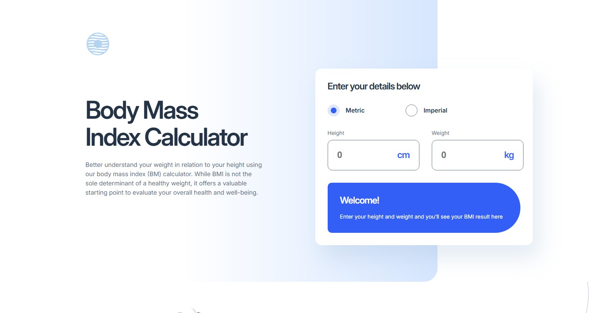

# Body Mass Index Calculator

A responsive Body Mass Index (BMI) Calculator built as a solution to the **Body Mass Index Calculator** challenge from [Frontend Mentor](https://www.frontendmentor.io/challenges/body-mass-index-calculator-brrBkfSz1T).

The project allows users to calculate their BMI using either **Metric** or **Imperial** units and provides personalized information based on the calculated result.

## 🚀 Live Demo

[View the live site](https://rodrigojesus7.github.io/body-mass-index-calculator/)

## 📸 Preview

## Overview

This project was developed to practice building a responsive and interactive web interface using **HTML, CSS, and JavaScript**.

The calculator dynamically updates the BMI result as the user enters their measurements and displays the corresponding BMI category and healthy weight range.

### ✨ Features

* Calculate BMI using Metric units (cm/kg)
* Calculate BMI using Imperial units (ft/in and st/lbs)
* Switch between Metric and Imperial units
* Dynamically calculate BMI as values are entered
* Display BMI classification:

  * Underweight
  * Healthy weight
  * Overweight
  * Obese
* Calculate the recommended weight range based on height
* Responsive layout for mobile, tablet, and desktop screens
* Keyboard interaction for the custom unit selectors
* Accessible form labels and focus states
* Responsive typography and layout using CSS media queries

## 🛠️ Built With

* Semantic HTML5
* CSS3

  * Flexbox
  * CSS Grid
  * Custom Properties
  * Media Queries
  * Responsive Design
* Vanilla JavaScript
* Google Fonts — Inter

## 🎯 What I Learned

During this project, I practiced and improved my understanding of:

* Handling user input with JavaScript
* Working with DOM manipulation
* Creating dynamic interfaces based on user interactions
* Implementing calculations and unit conversions
* Using CSS Grid to create complex responsive layouts
* Building responsive designs across different breakpoints
* Creating custom form controls while maintaining keyboard interaction
* Managing UI states with CSS classes
* Using CSS custom properties to maintain consistent design tokens

## ♿ Accessibility

Accessibility was considered throughout the development of the project, including:

* Semantic HTML elements
* Proper labels associated with form inputs
* Keyboard interaction for the custom unit selectors
* Visible focus states
* Logical content structure and heading hierarchy
* Responsive text and layout

## 📱 Responsive Design

The layout was designed to adapt to different screen sizes:

* **Mobile:** single-column layout optimized for smaller screens
* **Tablet:** expanded calculator and grid-based content sections
* **Desktop:** multi-column layouts with larger typography and additional decorative elements

## 💡 Challenge

This project was created as part of a challenge from **Frontend Mentor**, which provides professional designs to help developers improve their frontend development skills.

The goal was to reproduce the provided design as accurately as possible while making the page responsive and interactive.

## 👨‍💻 Author

**Rodrigo Costa**

Frontend Developer in transition to technology, currently focused on improving my skills in HTML, CSS, JavaScript, React and TypeScript.